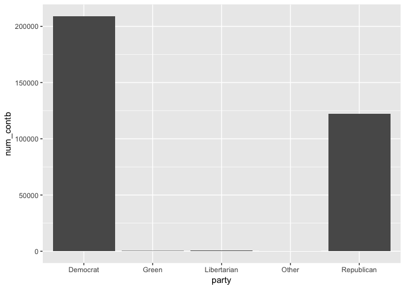
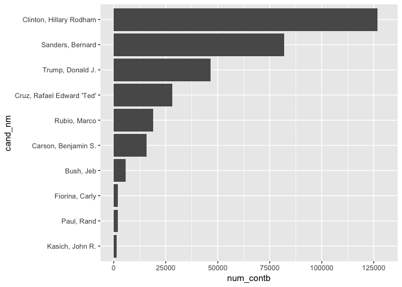
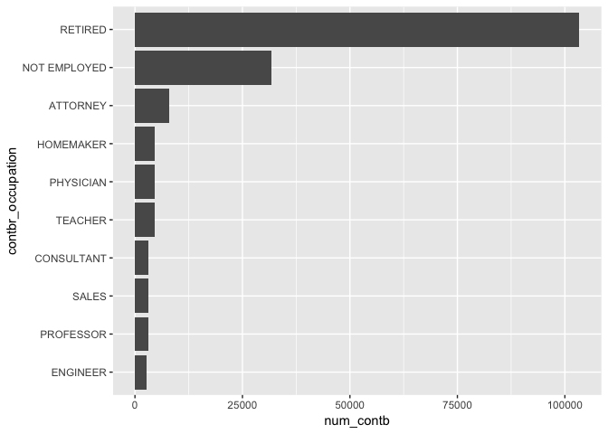
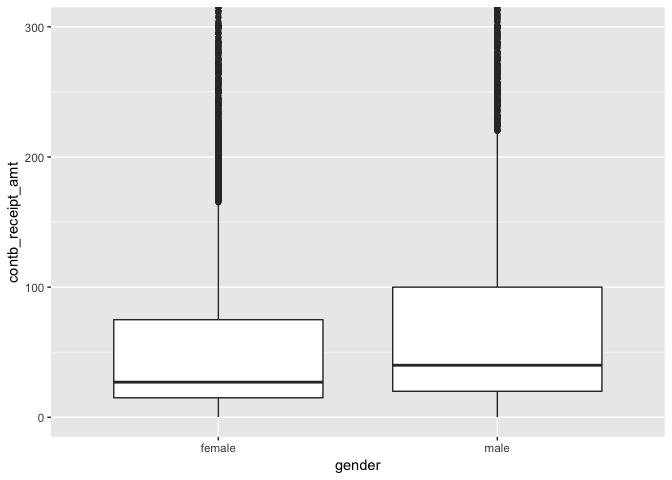
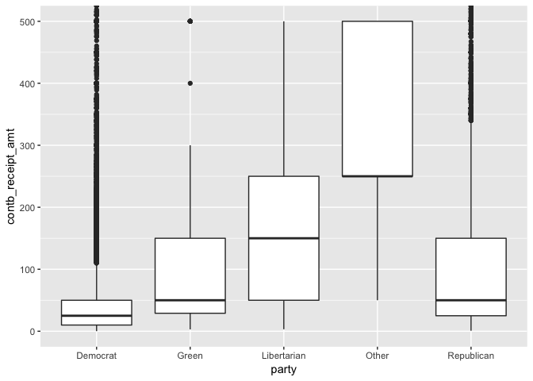
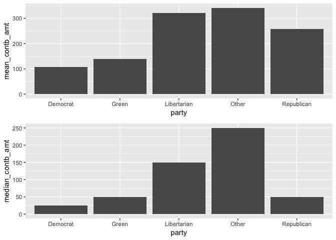
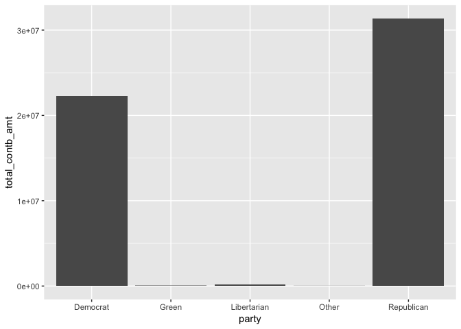
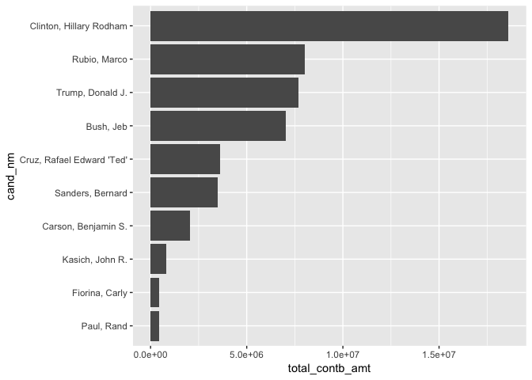
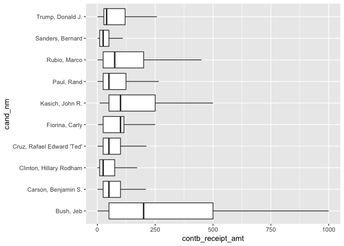
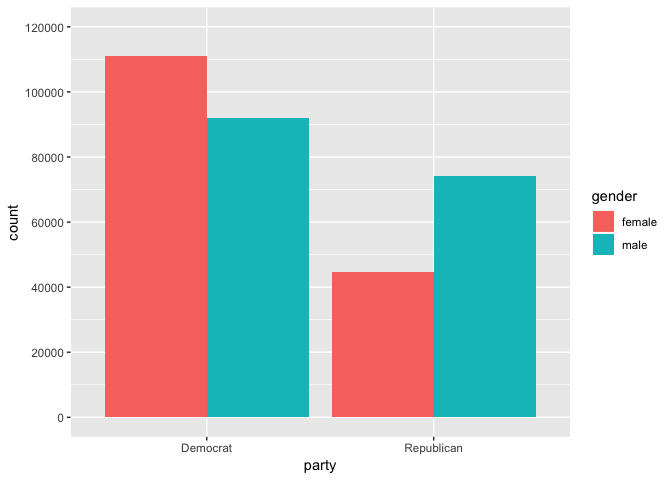

This report is an exploratory data analysis of campaign finance data from the Florida 2016 presidential primary elections.  A description of the different columns in the dataset is [here](https://www.dropbox.com/s/2fc15css7bp0jgq/CONTRIBUTOR_FORMAT.txt?dl=0).  I originally completed this analysis about a month before the November 2016 election. If I was doing the analysis retrospectively, then it would probably be different.  


```r
### load required packages
#install.packages("genderdata", repos = "http://packages.ropensci.org", type = #"source")

library(ggplot2)
library(dplyr)
library(knitr)
library(tidyr)
library(gender)
library(gridExtra)
```

## 1. Initial Data Wrangling

In my local folder I renamed the dataset to `FL_contributions.csv`.  There is a problem with loading the dataset directly, since the row names are not unique.  To get around this, set `row.names = Null`, which reads in the first column of the dataset as a column of data rather than row names.  This will assign the first column the column name `row.names` and shift all the other column names over by one, so that now the column names are no longer associcated with the correct columns.  We can fix this by first moving all the columns over one place (assigning `x` as a name for the last column), and then finally removing this last column.  

Also, there are a bunch of columns in the dataset that are not needed:

`cand_id, memo_cd, form_tp, file_num, tran_id, contbr_st`. 

I'm just going to remove these columns.


```r
### load the data
fl = read.csv('FL_contributions.csv', row.names = NULL)
colnames(fl) = c(colnames(fl)[-1], "x")
fl$x = NULL

### remove the columns that we don't need
fl = subset(fl, select = -c(cand_id, memo_cd, form_tp, file_num, tran_id, contbr_st))
```

I want to create 2 more categorical variables for my analysis:  Gender and political party affiliation.  To create the variable for gender, we first split the ` contbr_nm` column into 2 new columns `FirstName` and `LastName`:


```r
### Create a copy of the 'fl' dataframe
fl.1 = fl

### create a new column where the names are character types rather than factors
fl.1$contbr_nm.new = as.character(fl.1$contbr_nm)

### Extract the lastname and firstname from the 'contbr_nm.new' column.  
### Create 2 new columns in the dataframe:  'LastName', 'FirstName'
fl.1 = extract(fl.1, contbr_nm.new, c('LastName', 'FirstName'), '(.*),\\s*(\\S*)\\s*.*', fill = 'left', perl = TRUE)
```

We will now use the `gender()` function in R to predict gender based on a person's firstname.


```r
### Use gender() function to predict gender, then merge the columns with 'fl.1'
names_gender = gender(unique(fl.1$FirstName), method = "ssa" )
names_gender = names_gender[ , c('name', 'gender')]
fl.1 = merge(fl.1, names_gender, by.x = 'FirstName', by.y = 'name', all.x = TRUE)

### Drop 'FirstName' and 'LastName' columns from the dataset and make 'gender' into a factor variable
fl.1 = subset(fl.1, select = -c(FirstName, LastName))
fl.1$gender = factor(fl.1$gender)
```

Note that there are 9605 names where the `gender()` function returned NA:


```r
nrow(subset(fl.1, is.na(gender)))
```

```
## [1] 9605
```

So when we do any analysis using gender, we'll have to remember to exclude those rows from the dataset.  

Now let's create a variable for political party affiliation of the campaign contributor.  We will make the assumption that the contributor is affiliated with the same party as the candidate they donated to.


```r
### Create a variable for political party
democrat = c('Sanders, Bernard', 'Lessig, Lawrence', 'Clinton, Hillary Rodham',
              "O'Malley, Martin Joseph", 'Webb, James Henry Jr.')
libertarian = 'Johnson, Gary'
green = 'Stein, Jill'
other = 'McMullin, Evan'
all_cands = unique(fl.1$cand_nm)
republican = all_cands[ !(all_cands %in% c(democrat, libertarian, green, other))]

fl.1$party = with(fl.1, ifelse(cand_nm %in% democrat, 'Democrat',
                        ifelse(cand_nm %in% libertarian, 'Libertarian',
                        ifelse(cand_nm %in% green, 'Green',
                        ifelse(cand_nm %in% other, 'Other', 'Republican')))))

### Make 'party' into a factor variable
fl.1$party = factor(fl.1$party)
```

The column `contb_receipt_dt` is currently a factor variable.  Let's convert the column to date format so that we can eventually look at time series plots.


```r
fl.1$contb_receipt_dt = as.Date(fl.1$contb_receipt_dt, "%d-%b-%y")
```

Now we are ready to start the exploratory data analysis.

## 2. Univariate Analysis

Let's start by looking at some summaries of the dataset.  Here are the column variables in our dataset.  There are 14 of them.


```
##  [1] "cmte_id"           "cand_nm"           "contbr_nm"        
##  [4] "contbr_city"       "contbr_zip"        "contbr_employer"  
##  [7] "contbr_occupation" "contb_receipt_amt" "contb_receipt_dt" 
## [10] "receipt_desc"      "memo_text"         "election_tp"      
## [13] "gender"            "party"
```

The median contribution amount for all candidates is 28.42 and the mean contribution amount is 145.97.


```
##      Min.   1st Qu.    Median      Mean   3rd Qu.      Max. 
## -20000.00     15.00     28.42    145.97    100.00  20000.00
```

This suggests that the distribution of ` contb_receipt_amt` is right-skewed (and we will investigate this with some plots).  There are also negative contribution amounts which are probably refunds.

The candidate with the most individual contributions is Hillary Clinton (128353).


```
## 
##                 Bush, Jeb       Carson, Benjamin S. 
##                      6045                     16072 
##  Christie, Christopher J.   Clinton, Hillary Rodham 
##                       224                    128353 
## Cruz, Rafael Edward 'Ted'            Fiorina, Carly 
##                     29153                      2054 
##      Gilmore, James S III        Graham, Lindsey O. 
##                         1                       184 
##            Huckabee, Mike             Jindal, Bobby 
##                       418                        23 
##             Johnson, Gary           Kasich, John R. 
##                       654                      1342 
##          Lessig, Lawrence            McMullin, Evan 
##                        41                        38 
##   O'Malley, Martin Joseph         Pataki, George E. 
##                       152                        19 
##                Paul, Rand    Perry, James R. (Rick) 
##                      2024                        44 
##              Rubio, Marco          Sanders, Bernard 
##                     20472                     82527 
##      Santorum, Richard J.               Stein, Jill 
##                        85                       286 
##          Trump, Donald J.             Walker, Scott 
##                     46749                       410 
##     Webb, James Henry Jr. 
##                        32
```

The Democrat Party has the highest number of contributions with 211105, and the Republican Party has the 2nd highest number of contributions with 125319.


```
## 
##    Democrat       Green Libertarian       Other  Republican 
##      211105         286         654          38      125319
```

Now we'll start some data visualization and look at the distribution of contribution amounts, omitting the negative contributions.

<!-- -->

As I suspected, the data is highly skewed.  The vast majority of contributions are in the smaller range, but it's really hard to see from the graph.  Let's find the 99th percentile of all contribution amounts and then limit the x-axis at this value. The 99th percentile is


```
##  99% 
## 2700
```

Now let's look at the histogram again, but with the contribution amounts limited at 2700.  We will also add some more breaks on the x and y axes in order to see the amounts better, and apply a square root transformation to the y-axis, which gives us a better view of the values in the tail of the distribution.

<!-- -->

This is much better.  We can now see that most of the contributions are $100 or less with some spikes in contributions around $300, $500, $1000, $2000, $2500.  I assume these are people making larger contributions who decided on certain nice rounded numbers to contribute.

We can plot the x values on a log10 scale in order to see the smaller contribution amounts better.  It appears that the log-transformed plot is somewhat symmetric, maybe approximately normal.

<!-- -->

From this plot we can easily see that a large chunk of the contributions are $100 or less, and that the mode is $25.  In fact, $100 is the 75th percentile of individual contribution amounts, so 75% of the contributions are $100 or less.


```
## 75% 
## 100
```

I'm curious how the above distributions look when separated by gender. Are there any differences in the distributions for male versus female? 

<!-- --><!-- -->

Okay, so it appears that the distributions are quite similar across gender, although if we summarize the contribution amounts by gender, we can see that males contribute a bit more on average.


```
## pos_contb$gender: female
##     Min.  1st Qu.   Median     Mean  3rd Qu.     Max. 
##     0.21    15.00    27.00   128.78    75.00 10800.00 
## -------------------------------------------------------- 
## pos_contb$gender: male
##     Min.  1st Qu.   Median     Mean  3rd Qu.     Max. 
##     0.15    20.00    40.00   190.35   100.00 20000.00
```

How do the number of contributions change with respect to date? To visualize this we can look at a density plot of the variable `contb_receipt_dt` with the counts on the y-axis.

<!-- -->

The election year in question is 2016, and this plot shows that the number of contributions increase steadily as we get closer to the election.  There are also some spikes and dips in the plot.  I want to dig deeper into 2016 and see how the contributions change from month-to-month.

<!-- -->

We can see that the number of contributions increases until around March 1 and then starts to decrease again and fluctuate until about mid-May (March 1 2016 was actually Super Tuesday, and I don't know if this is related to the drop-off in contributions or not).  The contributions start to increase sharply again until July 10 or so, and then drop-off and fluctuate a bit after that.  Incidentally, July 12 was the date when Bernie Sanders endorsed Hillary Clinton (again, we don't know if these events are related or not). 

Now let's look at the number of contributions by political party.  

<!-- -->

```
## # A tibble: 5 x 2
##   party       num_contb
##   <fct>           <int>
## 1 Democrat       209044
## 2 Green             286
## 3 Libertarian       654
## 4 Other              36
## 5 Republican     122125
```

This graph clearly shows that the number of individual contributions to the 2 major parties (Democrat, Republican) dwarf the other contributions by far.  Also, there are many more individual contributions for Democrats (209044) than Republicans (122125).  We will see later though that the total contribution amount (sum of all contributions) is greater for Republicans than Democrats. 

Let's dig deeper into the contributions and look at the contributions by candidate. Here are the top 10 candidates by number of individual contributions.

<!-- -->

```
## # A tibble: 10 x 2
##    cand_nm                   num_contb
##    <fct>                         <int>
##  1 Clinton, Hillary Rodham      126869
##  2 Sanders, Bernard              81954
##  3 Trump, Donald J.              46669
##  4 Cruz, Rafael Edward 'Ted'     28242
##  5 Rubio, Marco                  18957
##  6 Carson, Benjamin S.           15824
##  7 Bush, Jeb                      5725
##  8 Fiorina, Carly                 2038
##  9 Paul, Rand                     2011
## 10 Kasich, John R.                1326
```

So we can see that Hillary Clinton has the most individual contributions (126869), followed by Bernie Sanders (81954), Donald Trump (46669), Ted Cruz (28242), etc.

Now let's use a similar bar graph to examine the top 10 occupations by number of contributions.

<!-- -->

```
## # A tibble: 10 x 2
##    contbr_occupation num_contb
##    <fct>                 <int>
##  1 RETIRED              103328
##  2 NOT EMPLOYED          31766
##  3 ATTORNEY               8055
##  4 HOMEMAKER              4653
##  5 PHYSICIAN              4647
##  6 TEACHER                4626
##  7 CONSULTANT             3200
##  8 SALES                  3108
##  9 PROFESSOR              3059
## 10 ENGINEER               2678
```

It's interesting to note that retired people make by far the most individual contributions (103328), followed by people who are not employed (31766), then attornies (8055), homemakers (4653), physicians (4647), etc.

### 2.1. Discussion

There are 337402 obeservations in the `fl.1` dataset and 14 features: 
```
cmte_id, cand_nm, contbr_nm, contbr_city, contbr_zip, contbr_employer, contbr_occupation, contb_receipt_amt, contb_receipt_dt, receipt_desc, memo_text, election_tp, gender, party
```
Not all these features are investigated in the analysis.  I also decided to drop the features
```
cand_id, memo_cd, form_tp, file_num, tran_id, contbr_st
```
from the original dataset, since I didn't think I would use them. A description of the different columns in the dataset can be found [here](https://www.dropbox.com/s/2fc15css7bp0jgq/CONTRIBUTOR_FORMAT.txt?dl=0).

Most of the features are categorical variables.  The ones that are not categorical variables are the following:

* cmte_id (character)
* contbr_zip (read in as a numerical variable, but should be categorical)
* contb_receipt_amt (numerical)
* contb_receipt_dt (date)

Some other observations:

* The contribution amount with the highest frequency is $25 and 75% of the contributions are $100 or less.
* Males contribute a bit more than females on average.  The median contribution amount for females is $27 and the median contribution amount for  males is $40.  The mean contribution amount for females is $128.80 and the mean contribution amount for males is $190.40.  Since the data is so positively skewed, the median is probably a better measure of center than the mean in this case.
* Democrats have more individual contributions than Republicans (209044 for Democrat, 122125 for Republicans), but the total contribution amount for Republicans is greater than for Democrats.  This is consistent with Republicans contributing more per contribution (on average).
* Hillary Clinton has the most individual contributions (126869), followed by Bernie Sanders, Donald Trump, and Ted Cruz.
* Retired people contributed by far the most to presidential campaigns in terms of individual contributions.  This is followed by people who are not employed, then attorneys.

I created two new categorical variables in the dataset:  gender and party.  To created the gender variable, I used the `gender()` function in R to predict the gender of a contributor based on their first name.  There were 9605 names where the gender could not be determined, but this only represents about 2.8% of the dataset. I created the party variable based on which candidate the person contributed to.

The contribution amounts data is very right-skewed because the majority of contributions come in smaller amounts and there there are some bigger donors who are more sparse.  In order to have a good look at the distribution, I limited the contribution amounts at the 99th percentile and then applied a squareroot transformation to the y-axis which allows us to see the tail of the distribution better.  We can also get a good look at the smaller contribution amounts by applying a log transformation on the x-axis.

The dataset was already in a tidy format.  Some grouping operations are performed on the dataset in this section and later sections.  I created some new tables where I grouped by candidate name, occupation, and party.  I also grouped by both candidate name/date, and also gender/date.  These are useful operations to perform and makes it easier to work with some plots and see some more statistical summaries of the raw data.

In the next section I will investigate the following features in more detail:
```
cand_nm, contbr_occupation, contb_receipt_amt, contb_receipt_dt, gender, party
```
We will see that there is a dependence relationship between gender and party, and that there is also a small negative correlation between contribution date and total contribution amount.

# 3. Bivariate Analysis

Let's look at boxplots for male and female contribution amounts. We have to limit the vertical axis a lot in order to see anything, since the data is so highly skewed.

<!-- -->

```
## pos_contb$gender: female
##     Min.  1st Qu.   Median     Mean  3rd Qu.     Max. 
##     0.21    15.00    27.00   128.78    75.00 10800.00 
## -------------------------------------------------------- 
## pos_contb$gender: male
##     Min.  1st Qu.   Median     Mean  3rd Qu.     Max. 
##     0.15    20.00    40.00   190.35   100.00 20000.00
```

As we already observed in the previous section, males contribute a bit more than females on average, and this is relected in the fact that the boxplot for males is shifted positively relative to the boxplot for females.

Let's now look at some boxplots of contribution amounts by party.

<!-- -->

```
## pos_contb$party: Democrat
##     Min.  1st Qu.   Median     Mean  3rd Qu.     Max. 
##     0.15    10.00    25.00   106.61    50.00 20000.00 
## -------------------------------------------------------- 
## pos_contb$party: Green
##    Min. 1st Qu.  Median    Mean 3rd Qu.    Max. 
##     3.0    29.0    50.0   138.9   150.0  2700.0 
## -------------------------------------------------------- 
## pos_contb$party: Libertarian
##    Min. 1st Qu.  Median    Mean 3rd Qu.    Max. 
##    3.18   50.00  150.00  321.25  250.00 3000.00 
## -------------------------------------------------------- 
## pos_contb$party: Other
##    Min. 1st Qu.  Median    Mean 3rd Qu.    Max. 
##      50     250     250     341     500    1000 
## -------------------------------------------------------- 
## pos_contb$party: Republican
##    Min. 1st Qu.  Median    Mean 3rd Qu.    Max. 
##     0.8    25.0    50.0   256.9   150.0 10800.0
```

This is interesting. It seems that there are some big differences in the distributions of contribution amounts conditional on party.  The distribution of contribution amounts for "Other" seems quite skewed relative to the distributions of the other parties, but this really has no practical significance since there are only 36 individual contributions in the "Other" category.


```
## [1] 36
```

We can also clearly see that the Democrat party has the smallest contribution amounts on average.  This is also reflected in the bar graphs given below, which show the mean and median contributions amounts by party.

<!-- -->

```
## # A tibble: 5 x 3
##   party       mean_contb_amt median_contb_amt
##   <fct>                <dbl>            <dbl>
## 1 Democrat              107.               25
## 2 Green                 139.               50
## 3 Libertarian           321.              150
## 4 Other                 341.              250
## 5 Republican            257.               50
```

The next bar graph displays the total contribution amount (sum of all contributions) by party.  It shows that the sum total of all contributions is actually greater for Republicans than Democrats even though the number of individual contributions is greater for Democrats.

<!-- -->

```
## # A tibble: 5 x 2
##   party       total_contb_amt
##   <fct>                 <dbl>
## 1 Democrat          22285883.
## 2 Green                39736.
## 3 Libertarian         210097.
## 4 Other                12275 
## 5 Republican        31371291.
```

Next we'll look at the top 10 candidates according to the total contribution amount.

<!-- -->

```
## # A tibble: 10 x 2
##    cand_nm                   total_contb_amt
##    <fct>                               <dbl>
##  1 Clinton, Hillary Rodham         18602454.
##  2 Rubio, Marco                     8022365.
##  3 Trump, Donald J.                 7705153.
##  4 Bush, Jeb                        7032449.
##  5 Cruz, Rafael Edward 'Ted'        3621333.
##  6 Sanders, Bernard                 3483259.
##  7 Carson, Benjamin S.              2036270.
##  8 Kasich, John R.                   795641.
##  9 Fiorina, Carly                    451328.
## 10 Paul, Rand                        424052.
```

Hillary Clinton also leads in total contributions (~18.6 million), followed by Marco Rubio (~8.02 million), Donald Trump (~7.7 million), Jeb Bush (~7.03 million), etc.  

Boxplots are also interesting to look at here.

<!-- -->

It appears that the distribution of contribution amounts for Jeb Bush is the most right-skewed.  This suggests that he received many of his contributions from "big donors" (and he still lost badly in the primary).  We can also see the stark contrast with Bernie Sanders' distribution of contribution amounts; Bernie's distribution seems to be the least right-skewed, which suggests that most of his contributions came in smaller amounts.  Just to get some perspective, let's look at the following table of the top 10 total contribution amounts.


```
## # A tibble: 10 x 4
##    cand_nm                   mean_contb_amt total_contb_amt num_contb
##    <fct>                              <dbl>           <dbl>     <int>
##  1 Clinton, Hillary Rodham            147.        18602454.    126869
##  2 Rubio, Marco                       423.         8022365.     18957
##  3 Trump, Donald J.                   165.         7705153.     46669
##  4 Bush, Jeb                         1228.         7032449.      5725
##  5 Cruz, Rafael Edward 'Ted'          128.         3621333.     28242
##  6 Sanders, Bernard                    42.5        3483259.     81954
##  7 Carson, Benjamin S.                129.         2036270.     15824
##  8 Kasich, John R.                    600.          795641.      1326
##  9 Fiorina, Carly                     221.          451328.      2038
## 10 Paul, Rand                         211.          424052.      2011
```

We can see that Jeb Bush's mean contribution amount is $1228.38, but he only received 5725 individual contributions. Bernie Sanders' mean contribution amount is $42.50, and he received 81954 individual contributions.  This is a big contrast.

I'm curious if there is a dependence relationship between gender and political party.  Let's first make a contigency table for these two categorical variables, and also look at a bar plot.  In the bar plot we will keep only Republicans and Democrats since the other parties have so many fewer contributions in comparison.


```
##         
##          Democrat  Green Libertarian  Other Republican
##   female   111105     89          98     18      44639
##   male      91943    196         547     18      74140
```

<!-- -->

We can see that females make more contributions than males to the Democrat party, while males make more contributions than females to the Republican party. It's also clear from the table that more males than females contributed to the Green and Libertarian parties as well.  Both the table and bar plot suggest that there may be a dependence relationship between party and gender.  Is this relationship statistically significant? Let's test the following null and alternative hypotheses using a significance level of $\alpha = 0.05$:

$H_0$ : Gender and party are independent.

$H_A$ : Gender and party are dependent.


```
## 
## 	Pearson's Chi-squared test
## 
## data:  table(pos_contb$gender, pos_contb$party)
## X-squared = 9130.9, df = 4, p-value < 2.2e-16
```

We find that the $\chi^2$-test statistic is 9130.9 and the corresponding P-value is less than 0.001.  Therefore, reject the null hypothesis.  There is sufficient evidence that the gender and party variables are dependent.  Although the test does not tell us how the results are significant, we can see from the data that females contribute more than males to the Democrat party and less than males to the Green, Libertarian, and Republican parties.
