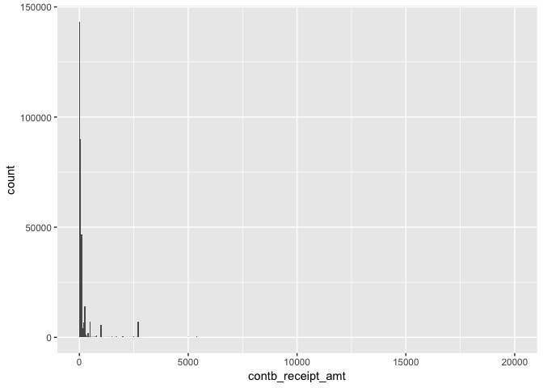
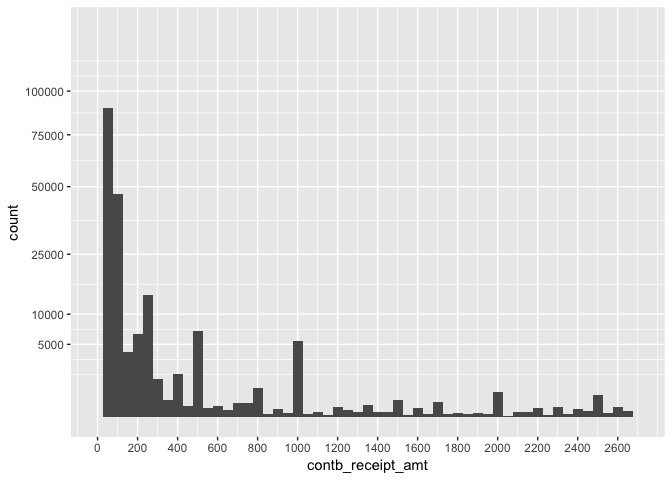
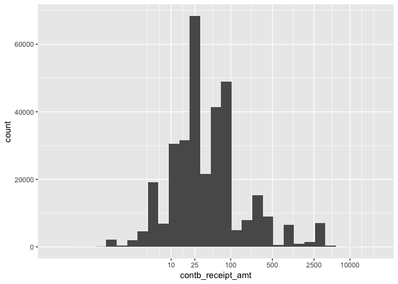
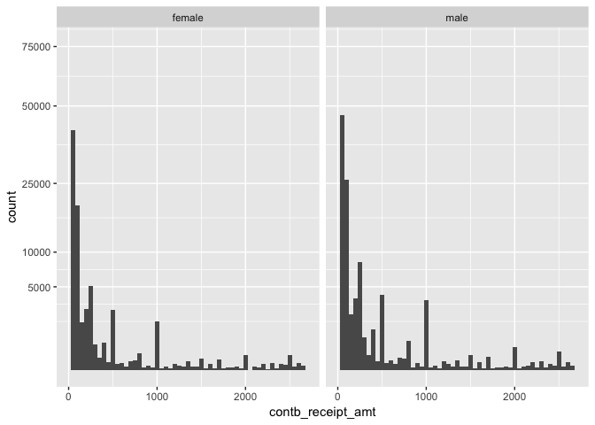
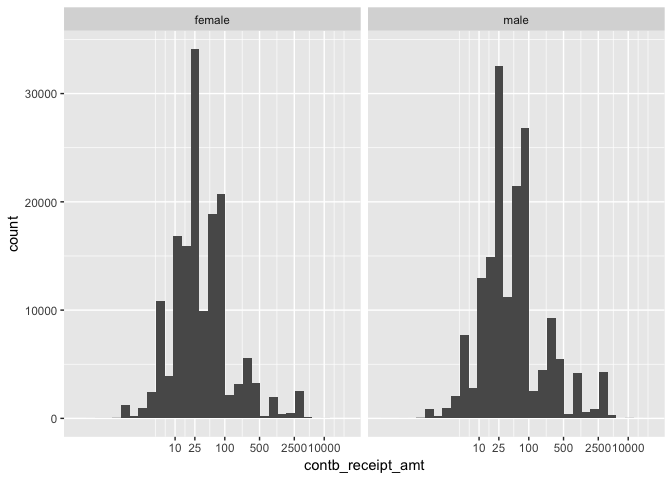
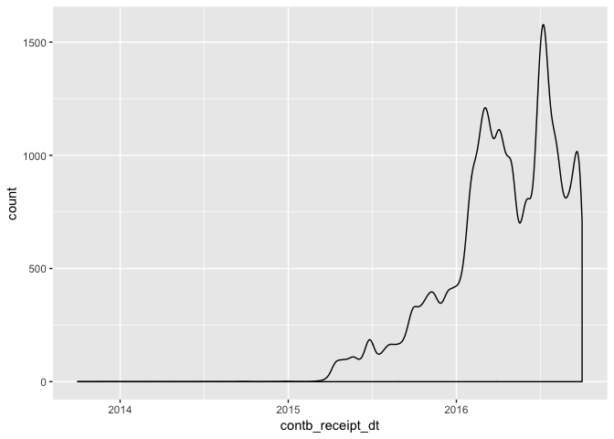
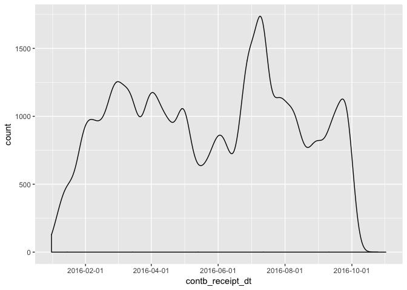

This report is an exploratory data analysis of campaign finance data from the Florida 2016 presidential primary elections.  A description of the different columns in the dataset is [here](https://www.dropbox.com/s/2fc15css7bp0jgq/CONTRIBUTOR_FORMAT.txt?dl=0).  I originally completed this analysis about a month before the November 2016 election. If I was doing the analysis retrospectively, then it would probably be different.  


```r
### load required packages
#install.packages("genderdata", repos = "http://packages.ropensci.org", type = #"source")

library(ggplot2)
library(dplyr)
library(knitr)
library(tidyr)
library(gender)
library(gridExtra)
```

## 1. Initial Data Wrangling

In my local folder I renamed the dataset to `FL_contributions.csv`.  There is a problem with loading the dataset directly, since the row names are not unique.  To get around this, set `row.names = Null`, which reads in the first column of the dataset as a column of data rather than row names.  This will assign the first column the column name `row.names` and shift all the other column names over by one, so that now the column names are no longer associcated with the correct columns.  We can fix this by first moving all the columns over one place (assigning `x` as a name for the last column), and then finally removing this last column.  

Also, there are a bunch of columns in the dataset that are not needed:

`cand_id, memo_cd, form_tp, file_num, tran_id, contbr_st`. 

I'm just going to remove these columns.


```r
### load the data
fl = read.csv('FL_contributions.csv', row.names = NULL)
colnames(fl) = c(colnames(fl)[-1], "x")
fl$x = NULL

### remove the columns that we don't need
fl = subset(fl, select = -c(cand_id, memo_cd, form_tp, file_num, tran_id, contbr_st))
```

I want to create 2 more categorical variables for my analysis:  Gender and political party affiliation.  To create the variable for gender, we first split the ` contbr_nm` column into 2 new columns `FirstName` and `LastName`:


```r
### Create a copy of the 'fl' dataframe
fl.1 = fl

### create a new column where the names are character types rather than factors
fl.1$contbr_nm.new = as.character(fl.1$contbr_nm)

### Extract the lastname and firstname from the 'contbr_nm.new' column.  
### Create 2 new columns in the dataframe:  'LastName', 'FirstName'
fl.1 = extract(fl.1, contbr_nm.new, c('LastName', 'FirstName'), '(.*),\\s*(\\S*)\\s*.*', fill = 'left', perl = TRUE)
```

We will now use the `gender()` function in R to predict gender based on a person's firstname.


```r
### Use gender() function to predict gender, then merge the columns with 'fl.1'
names_gender = gender(unique(fl.1$FirstName), method = "ssa" )
names_gender = names_gender[ , c('name', 'gender')]
fl.1 = merge(fl.1, names_gender, by.x = 'FirstName', by.y = 'name', all.x = TRUE)

### Drop 'FirstName' and 'LastName' columns from the dataset and make 'gender' into a factor variable
fl.1 = subset(fl.1, select = -c(FirstName, LastName))
fl.1$gender = factor(fl.1$gender)
```

Note that there are 9605 names where the `gender()` function returned NA:


```r
nrow(subset(fl.1, is.na(gender)))
```

```
## [1] 9605
```

So when we do any analysis using gender, we'll have to remember to exclude those rows from the dataset.  

Now let's create a variable for political party affiliation of the campaign contributor.  We will make the assumption that the contributor is affiliated with the same party as the candidate they donated to.


```r
### Create a variable for political party
democrat = c('Sanders, Bernard', 'Lessig, Lawrence', 'Clinton, Hillary Rodham',
              "O'Malley, Martin Joseph", 'Webb, James Henry Jr.')
libertarian = 'Johnson, Gary'
green = 'Stein, Jill'
other = 'McMullin, Evan'
all_cands = unique(fl.1$cand_nm)
republican = all_cands[ !(all_cands %in% c(democrat, libertarian, green, other))]

fl.1$party = with(fl.1, ifelse(cand_nm %in% democrat, 'Democrat',
                        ifelse(cand_nm %in% libertarian, 'Libertarian',
                        ifelse(cand_nm %in% green, 'Green',
                        ifelse(cand_nm %in% other, 'Other', 'Republican')))))

### Make 'party' into a factor variable
fl.1$party = factor(fl.1$party)
```

The column `contb_receipt_dt` is currently a factor variable.  Let's convert the column to date format so that we can eventually look at time series plots.


```r
fl.1$contb_receipt_dt = as.Date(fl.1$contb_receipt_dt, "%d-%b-%y")
```

Now we are ready to start the exploratory data analysis.

## 2. Univariate Analysis

Let's start by looking at some summaries of the dataset.  Here are the column variables in our dataset.  There are 14 of them.


```
##  [1] "cmte_id"           "cand_nm"           "contbr_nm"        
##  [4] "contbr_city"       "contbr_zip"        "contbr_employer"  
##  [7] "contbr_occupation" "contb_receipt_amt" "contb_receipt_dt" 
## [10] "receipt_desc"      "memo_text"         "election_tp"      
## [13] "gender"            "party"
```

The median contribution amount for all candidates is 28.42 and the mean contribution amount is 145.97.


```
##      Min.   1st Qu.    Median      Mean   3rd Qu.      Max. 
## -20000.00     15.00     28.42    145.97    100.00  20000.00
```

This suggests that the distribution of ` contb_receipt_amt` is right-skewed (and we will investigate this with some plots).  There are also negative contribution amounts which are probably refunds.

The candidate with the most individual contributions is Hillary Clinton (128353).


```
## 
##                 Bush, Jeb       Carson, Benjamin S. 
##                      6045                     16072 
##  Christie, Christopher J.   Clinton, Hillary Rodham 
##                       224                    128353 
## Cruz, Rafael Edward 'Ted'            Fiorina, Carly 
##                     29153                      2054 
##      Gilmore, James S III        Graham, Lindsey O. 
##                         1                       184 
##            Huckabee, Mike             Jindal, Bobby 
##                       418                        23 
##             Johnson, Gary           Kasich, John R. 
##                       654                      1342 
##          Lessig, Lawrence            McMullin, Evan 
##                        41                        38 
##   O'Malley, Martin Joseph         Pataki, George E. 
##                       152                        19 
##                Paul, Rand    Perry, James R. (Rick) 
##                      2024                        44 
##              Rubio, Marco          Sanders, Bernard 
##                     20472                     82527 
##      Santorum, Richard J.               Stein, Jill 
##                        85                       286 
##          Trump, Donald J.             Walker, Scott 
##                     46749                       410 
##     Webb, James Henry Jr. 
##                        32
```

The Democrat Party has the highest number of contributions with 211105, and the Republican Party has the 2nd highest number of contributions with 125319.


```
## 
##    Democrat       Green Libertarian       Other  Republican 
##      211105         286         654          38      125319
```

Now we'll start some data visualization and look at the distribution of contribution amounts, omitting the negative contributions.

<!-- -->

As I suspected, the data is highly skewed.  The vast majority of contributions are in the smaller range, but it's really hard to see from the graph.  Let's find the 99th percentile of all contribution amounts and then limit the x-axis at this value. The 99th percentile is


```
##  99% 
## 2700
```

Now let's look at the histogram again, but with the contribution amounts limited at 2700.  We will also add some more breaks on the x and y axes in order to see the amounts better, and apply a square root transformation to the y-axis, which gives us a better view of the values in the tail of the distribution.

<!-- -->

This is much better.  We can now see that most of the contributions are $100 or less with some spikes in contributions around $300, $500, $1000, $2000, $2500.  I assume these are people making larger contributions who decided on certain nice rounded numbers to contribute.

We can plot the x values on a log10 scale in order to see the smaller contribution amounts better.  It appears that the log-transformed plot is somewhat symmetric, maybe approximately normal.

<!-- -->

From this plot we can easily see that a large chunk of the contributions are $100 or less, and that the mode is $25.  In fact, $100 is the 75th percentile of individual contribution amounts, so 75% of the contributions are $100 or less.


```
## 75% 
## 100
```

I'm curious how the above distributions look when separated by gender. Are there any differences in the distributions for male versus female? 

<!-- --><!-- -->

Okay, so it appears that the distributions are quite similar across gender, although if we summarize the contribution amounts by gender, we can see that males contribute a bit more on average.


```
## pos_contb$gender: female
##     Min.  1st Qu.   Median     Mean  3rd Qu.     Max. 
##     0.21    15.00    27.00   128.78    75.00 10800.00 
## -------------------------------------------------------- 
## pos_contb$gender: male
##     Min.  1st Qu.   Median     Mean  3rd Qu.     Max. 
##     0.15    20.00    40.00   190.35   100.00 20000.00
```

How do the number of contributions change with respect to date? To visualize this we can look at a density plot of the variable `contb_receipt_dt` with the counts on the y-axis.

<!-- -->

The election year in question is 2016, and this plot shows that the number of contributions increase steadily as we get closer to the election.  There are also some spikes and dips in the plot.  I want to dig deeper into 2016 and see how the contributions change from month-to-month.

<!-- -->

We can see that the number of contributions increases until around March 1 and then starts to decrease again and fluctuate until about mid-May (March 1 2016 was actually Super Tuesday, and I don't know if this is related to the drop-off in contributions or not).  The contributions start to increase sharply again until July 10 or so, and then drop-off and fluctuate a bit after that.  Incidentally, July 12 was the date when Bernie Sanders endorsed Hillary Clinton (again, we don't know if these events are related or not). 
